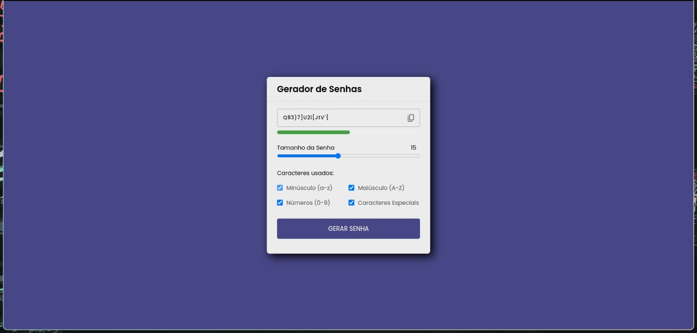

#  Gerador de Senhas

Bem-vindo ao **Gerador de Senhas**! Este projeto permite que você crie senhas seguras e aleatórias com uma variedade de caracteres. Ideal para proteger suas contas e dados pessoais.


## Índice

- [Introdução](#introdução)
- [Requisitos](#requisitos)
- [Instalação](#instalação)
- [Uso Online](#uso-online)
- [Uso Local](#uso-local)
- [Exemplos](#exemplos)
- [Tecnologias Utilizadas](#tecnologias-utilizadas)
- [Contribuindo](#contribuindo)
- [Licença](#licença)
- [Contato](#contato)

## Introdução

Este projeto é um gerador de senhas aleatórias que permite aos usuários selecionar diferentes tipos de caracteres, incluindo letras maiúsculas, minúsculas, números e caracteres especiais. A interface é simples e fácil de usar. Além disso, o projeto é totalmente responsivo, garantindo uma experiência de uso excelente em dispositivos móveis e desktops.

## Requisitos

- Navegador da Web moderno (Google Chrome, Mozilla Firefox, etc.)
- [Node.js](https://nodejs.org/) (opcional, se você quiser configurar um servidor de desenvolvimento)

## Instalação

1. Clone o repositório para sua máquina local:
    ```sh
    git clone https://github.com/DevRarosh/Projeto-gerador-de-senhas.git
    ```

2. Navegue até o diretório do projeto:
    ```sh
    cd projeto-gerador-de-senhas
    ```

##Uso Online

Você pode usar o gerador de senhas diretamente online através do link:

[Gerador de Senhas Online](https://tinyurl.com/3sye8v66)

## Uso Local

1. Abra o arquivo `index.html` em seu navegador para visualizar e usar o gerador de senhas.

2. Selecione os tipos de caracteres que deseja incluir na senha:
    - Minúsculo (a-z)
    - Maiúsculo (A-Z)
    - Números (0-9)
    - Caracteres Especiais

3. Ajuste o comprimento da senha usando o controle deslizante.

4. Clique no botão "Gerar Senha" para criar uma nova senha.

5. Clique no ícone de copiar para copiar a senha gerada para a área de transferência.

## Exemplos

## Gerando uma senha com diferentes tipos de caracteres

1. **Selecionar Caracteres:**
    

2. **Ajustar Comprimento:**
    

3. **Gerar e Copiar Senha:**
    

## Tecnologias Utilizadas

- **HTML5**: Utilizado para a estruturação da página.
- **CSS3**: Utilizado para o estilo da página e responsividade.
- **JavaScript**: Utilizado para a lógica do gerador de senhas.
- **Toastify JS**: Biblioteca para notificações e mensagens de toast.
- **Google Fonts**: Utilizado para ícones (Material Symbols Outlined).

## Contribuindo

Contribuições são bem-vindas! Para contribuir:

1. Faça um fork do projeto.
2. Crie uma branch para sua feature (`git checkout -b feature/AmazingFeature`).
3. Commit suas mudanças (`git commit -m 'Add some AmazingFeature'`).
4. Faça o push para a branch (`git push origin feature/AmazingFeature`).
5. Abra um Pull Request.

## Licença

Distribuído sob a licença MIT. Veja `LICENSE` para mais informações.

## Contato

[@Ramon Brito](https://www.linkedin.com/in/ramon-brito-439975279/) - ramonferreira@aluno.uniateneu.edu.br

Link do Projeto: [Gerador de Senhas](https://github.com/DevRarosh/Projeto-gerador-de-senhas)

---

Feito por [Ramon Brito](https://github.com/DevRarosh)
